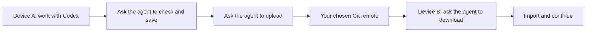

# Codex Project Transfer

**Switch computers. Pick up the conversation.**

Git carries your code between machines. Your Codex debugging sessions and design discussions deserve to travel with it. This skill saves native project sessions locally and lets your agent upload or download them when you ask.

**Check, save, and transfer only when you ask.** No hooks, background polling, or automatic saving; the plugin stays idle between requests.

[中文](README.md)

## When to use it

- Switch between computers: upload before leaving, download on the receiving device.
- Return to a long-running project with its conversations and investigation history.
- Back up sessions by project before moving to another machine.
- Keep background overhead low without finding and copying session files yourself.

## Workflow

Codex keeps its normal chat history. This plugin snapshots project sessions only when you request a check, save, upload, or sync. Setup does not save sessions or start any background work. Downloads never upload local history. Uploads read remote history first to preserve other devices' records.

Use your own private Git remote without deploying another server. A dedicated session branch keeps transfers separate from code commits. Divergent continuations are preserved.

## First use

Have Python 3.10+, Git, and Codex available. Keep this project in a persistent local directory and ask your agent:

> Read `skills/codex-project-transfer/SKILL.md` in this project and install the skill.

Provide the full path if necessary. Installation prepares a **virtual environment inside the plugin directory**. No global Python packages, activation, or PATH changes are required. Open a new chat afterward. Native plugin-manager installations can use the bundled skill directly.

## Set up your project

In the Git project, say:

> Use $codex-project-transfer to initialize this project and remember origin. Install no hooks; check, save, or transfer sessions only when I ask.

Setup is local and does not save or transfer chats. No hook configuration or trust review is needed.

**Your required actions:**

1. Complete Git authentication if prompted during a transfer.
2. Choose a repository authorized to hold full chats, including possible code and command output. A private repository is recommended.

## Everyday requests

| Ask your agent | Result |
|---|---|
| “Check and save this project's sessions.” | Create local snapshots and inspect the result, without remote access |
| “Upload this project's sessions.” | Save local project sessions and upload |
| “Download this project's sessions.” | Fetch and import, without uploading |
| “Sync both directions once.” | One upload/download operation |
| “Save locally only.” | Save without remote access |
| “Check transfer status.” | Inspect local status without transferring |
| “My imported chat is missing.” | Diagnose local restoration |

On another device, prepare the same code repository and plugin, then ask the agent to configure the project and download sessions. Failed transfers preserve local records; ask again when ready to retry.

Open chats cannot safely have their history replaced. The agent will tell you when clients must close and provide the necessary follow-up. Conflicting continuations are kept for you to choose between.

## Availability

Native chat history is transferred; code, external attachments, credentials, and running processes are not. CLI restoration is verified on macOS. Desktop/VS Code GUI continuation and Windows/Linux real-device use still need validation. Ordinary ChatGPT web history is outside scope.

Keep the plugin directory in place; reinstall if it moves.
