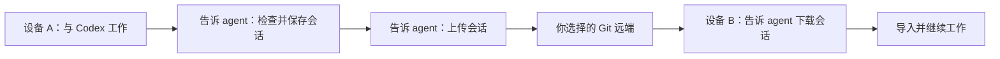

# Codex Project Transfer

**换台电脑，接着聊你的项目。**

代码可以用 Git 带走，和 Codex 一起排查问题、讨论方案的聊天也值得保存。Codex Project Transfer 将项目的原生会话保存在本地，在你需要时通过 Git 上传或下载，让另一台设备可以导入后继续工作。

它以 skill 的方式交给 agent 使用。**检查、保存和传输，都由你说了算。** agent 会选择命令、处理路径并检查结果；没有钩子、后台轮询或自动保存，平时不运行。

[English](README.en.md)

## 适合什么场景

- **多台电脑切换开发**：离开一台电脑前上传，到另一台电脑后下载。
- **长周期项目**：回来时找回之前的聊天、工具记录和排查过程。
- **换机备份**：按项目保存会话，在新设备准备好代码后恢复。
- **希望减少后台开销**：按需传输，不用持续轮询，也不用手动寻找会话文件。

## 工作流程

Codex 仍会正常保留自己的聊天历史；只有你要求检查、保存或上传时，本插件才将项目会话保存到仓库目录。**保存、上传、下载和双向同步都由你的指令触发**，配置项目不会启动后台任务。下载不会把本机记录上传；上传会先读取远端历史以保留其他设备的记录。

记录可以使用自己的私有 Git 远端存放，无需额外部署同步服务器。会话传输使用独立分支，不会替你提交代码；两端分别续聊发生分叉时，会保留双方记录。

## 第一次使用

准备好 Python 3.10+、Git 和 Codex，下载本项目，然后告诉 agent：

> 请读取这个项目里的 `skills/codex-project-transfer/SKILL.md`，安装这个技能。

如果 agent 没有打开本项目，请提供该文件的完整路径。安装器会准备**skill 目录内的局部虚拟环境**，无需全局安装 Python 包、手动激活环境或修改 PATH。运行代码、脚本和说明文件也会一并复制到该 skill 文件夹，安装后可以移除下载的原项目目录。完成后打开一个新聊天。

如果已通过支持该插件的管理器安装，让 agent 按附带技能的说明完成安装即可。

## 设置你的项目

在工作的 Git 项目中告诉 agent：

> 使用 $codex-project-transfer，初始化当前项目，远端使用 origin。不要安装钩子，只有我要求检查、保存或传输时才操作。

agent 会完成本地设置并记住远端，不会立即保存、上传或下载。无需配置或信任钩子。

**你需要亲自完成：**

1. 首次传输时，如果 Git 要求登录，完成认证。
2. 选择允许存放完整聊天内容的仓库。聊天可能包含代码和命令输出，建议使用私有仓库。

## 日常这样说

| 你对 agent 说 | 它会做什么 |
|---|---|
| “检查并保存当前项目的会话。” | 生成本地快照并检查结果，不访问远端 |
| “上传当前项目的会话。” | 保存本机项目会话并上传 |
| “下载这个项目的会话。” | 读取远端并导入，不上传本机记录 |
| “现在双向同步一次。” | 执行一次上传和下载 |
| “只保存到本地。” | 保存记录，不访问远端 |
| “检查同步状态。” | 查看本地状态，不发起传输 |
| “导入的聊天没有显示，帮我检查。” | 检查本机恢复结果 |

切换设备时，在新设备准备好同一个代码仓库和本插件，然后让 agent 配置项目并下载会话即可。传输失败后会保留本地记录，你可以稍后再告诉 agent 重试。

**正在打开的聊天不能直接替换历史。** 如果已有会话需要更新，agent 会提示你关闭相关客户端，并提供必要的后续操作。发生分叉时，两份记录都会保留，由你决定继续哪一份。

## 使用范围

- 同步的是原生 Codex 会话；代码、外部附件、登录凭据和运行中的程序需要另行处理。
- 已验证 macOS 上 Codex CLI 的历史恢复。桌面 App、VS Code 的实际界面续聊，以及 Windows/Linux 实机使用仍待验证。
- 普通 ChatGPT 网页聊天不在支持范围内。
- 每台设备单独安装，局部虚拟环境会在 skill 文件夹内创建。
